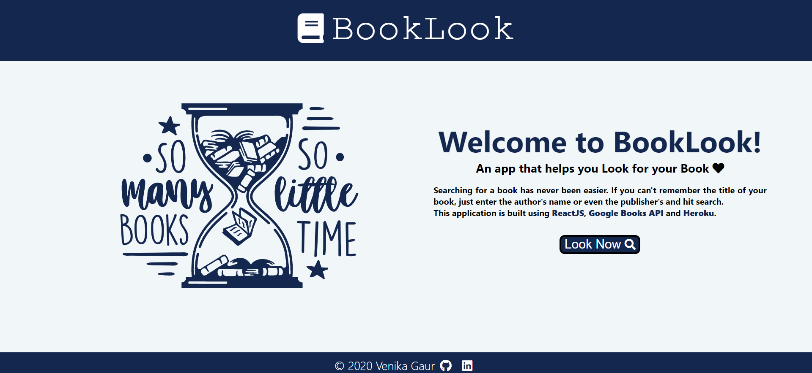

# Booklook
Booklook is a web app that uses Google books API to allow users to search for a book and then leads the user to the preview page of that book.

# Development
I used create-react-app to bootstrap the base app creation. Then I used Google books API to return the books relating to user's search query. To make app a bit more refined, I created a landing page and then, used the react-router-dom to go from landing page to search page.

# Demo
To try the booklook app, just visit this link- https://booklook-webapp.herokuapp.com/

# Screenshots
  
       
       
  

# Future updates
I would like to create another page that lists info about a book when users click on a search result instead of leading them directly to the google books

# Helpful links
- https://reactjs.org/
- https://reactrouter.com/web/guides/quick-start
- https://developers.google.com/books
